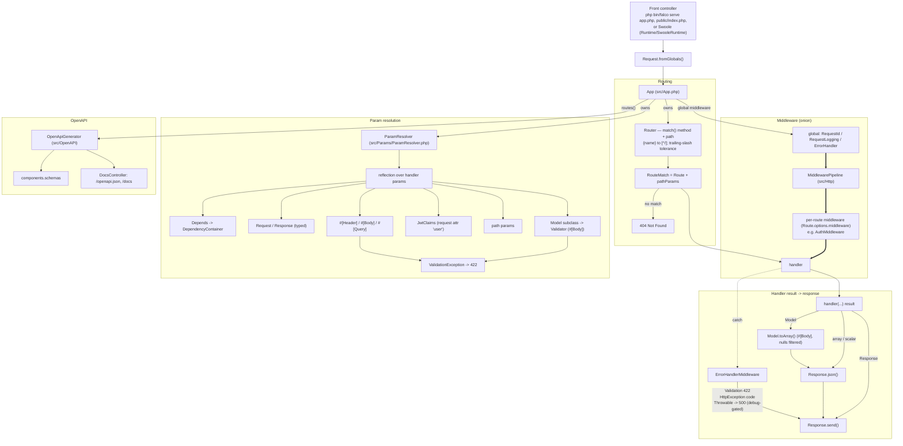

# Falco

A FastAPI-style web framework for PHP 8.1+. Declarative route handlers with parameters resolved by type and attribute, automatic OpenAPI 3.1 docs, JWT auth with refresh-token rotation, structured JSON logging, Prometheus metrics, and health checks — all with **zero runtime dependencies** (PHP standard library + a Composer PSR-4 autoloader).

Falco borrows FastAPI's ergonomics — function handlers whose parameters are resolved by type — and adapts them to PHP 8.x (constructor property promotion, attributes, named arguments, readonly/final classes). It is a single process boundary, `App::handle(Request): Response`; there is no service container or magic: application wiring is plain PHP.

## Table of contents

- [Install](#install)
- [Quick start](#quick-start)
- [Run](#run)
- [Features](#features)
- [Production](#production)
  - [Deploy targets](#deploy-targets)
  - [Security checklist](#security-checklist)
- [Architecture](#architecture)
  - [Request lifecycle](#request-lifecycle)
  - [Router](#router)
  - [Parameter resolution](#parameter-resolution)
  - [Models & validation](#models--validation)
  - [Middleware](#middleware)
  - [Auth: JWT + refresh tokens](#auth-jwt--refresh-tokens)
  - [Rate limiting](#rate-limiting)
  - [Data layer](#data-layer)
  - [Observability](#observability)
  - [Runtime](#runtime)
- [Environment](#environment)
- [Examples](#examples)
- [Testing](#testing)
- [FAQ](#faq)
- [License](#license)

## Install

```bash
git clone <repo> && cd FastAPI-PHP
php composer.phar install
# Composer is only used for development (PHPUnit) autoloading.
# At runtime Falco has ZERO dependencies: it loads its own PSR-4 map.
```

On a host without Composer (e.g. shared hosting), you can bootstrap the autoloader yourself:

```php
<?php
spl_autoload_register(function (string $class): void {
    $prefix = 'Falco\\';
    if (!str_starts_with($class, $prefix)) return;
    $file = __DIR__ . '/src/' . str_replace(['\\', "\0"], ['/', ''], substr($class, strlen($prefix))) . '.php';
    if (is_file($file)) require $file;
});
```

## Quick start

```php
<?php // app.php
require 'vendor/autoload.php';

use Falco\App;
use Falco\Params\Body;

$app = new App(title: 'Hello', version: '0.1.0');

// GET /  -> ["message":"Hello, World!"]
$app->get('/', function (): array {
    return ['message' => 'Hello, World!'];
});

// POST /echo  -> echoes the JSON body
$app->post('/echo', function (#[Body] array $payload): array {
    return ['you sent' => $payload];
});

// GET /hi/{name}  -> path param resolved by name
$app->get('/hi/{name}', function (string $name): array {
    return ['message' => "Hi, {$name}!"];
});

return $app;
```

`App` is the only public surface you instantiate. The constructor accepts `title`, `version`, `docs` (default `true`, registers `/openapi.json` + `/docs`), and `debug` (default `false`, gates 500 error detail). `App::middleware()` pushes global middleware; `App::get/post/put/patch/delete()` register routes and return nothing (routes are stored in the internal `Router`).

### What a handler can return

`App::invokeHandler()` normalizes the return value of every handler:

| Return value | Result |
|---|---|
| `Falco\Response` | sent as-is (status + headers + body). |
| `Falco\Model` | `toArray()` is called and `null` values are stripped; sent as JSON. |
| `array` / `int` / `float` / `string` / `bool` | wrapped in `Response::json([ … ])`. |

### Error mapping

Exceptions thrown during resolution or handler execution are converted to JSON:

| Exception | HTTP status | Body |
|---|---|---|
| `Validation\ValidationException` | 422 | `{ "detail": [ { "loc": ["body","name"], "msg": "Field required", "type": "missing" } ] }` |
| `HttpException` (thrown by hand or middleware) | the exception's `statusCode` | `{ "detail": "<message>" }` |
| any other `Throwable` | 500 | `{ "detail": "<message>" }` only when `debug` is true, otherwise `{ "detail": "Internal Server Error" }` |

Because `ErrorHandlerMiddleware` sits in the global pipeline AND `invokeHandler()` has its own try/catch, the two layers are redundant by design so that errors thrown *before* the pipeline (e.g. inside a custom front controller) still produce a JSON 500.

## Run

```bash
php bin/falco serve examples/items/app.php
# -> http://127.0.0.1:8000
# Interactive docs: /docs   OpenAPI schema: /openapi.json
```

For a full, production-ready example — JWT auth with refresh rotation, SQLite storage, `/health`, `/metrics`, CORS, rate limiting, structured logging — see `examples/items/app.php`. Its `conf.php` bootstraps environment (real env vars _or_ `env.php` on shared hosts like Hostinger) and `public/` holds a shared-hosting front controller (`index.php` + `.htaccess`).

> `php bin/falco serve` runs PHP's single-threaded built-in server, so requests are handled sequentially. For concurrency, deploy on nginx + php-fpm (`public/index.php` or `bin/server.php` as the router), or Swoole — see [Runtime](#runtime).

## Features

- **Type-hinted handlers** — query, path, and body parameters are resolved from plain PHP types and `Falco\Params` attributes.
- **`Model` classes** with reflection-driven `fromArray()`/`toArray()` coercion and FastAPI-style validation errors.
- **Param attributes** — `#[Depends]` (DI), `#[Query]`, `#[Header]`, `#[Body]`.
- **Path params** resolved by name from the route template (`{name}` → `$name`).
- **Automatic OpenAPI 3.1** — interactive Swagger UI at `/docs` and machine-readable schema at `/openapi.json`, generated entirely by reflection (no annotations to maintain).
- **Two runtimes** — PHP built-in server (`php -S`, via `bin/server.php`) and an optional Swoole runtime (`--swoole`).
- **Middleware pipeline** — global + per-route, onion-style, supporting both `MiddlewareInterface` classes and plain callables.
- **JWT auth** — HS256 access tokens with a configurable TTL; refresh tokens are random 256-bit values, stored only as SHA-256 hashes, single-use, expiry-checked, and rotatable.
- **Structured JSON logging** — one JSON object per line, request-ID correlated, resilient to `json_encode` failure.
- **Prometheus metrics** (`/metrics`) — `Counter` and `Histogram` instrumented automatically by `MetricsMiddleware`.
- **Health checks** — `/health/live` (always 200) and `/health/ready` (arbitrary readiness callbacks; 503 on failure).
- **CORS** (with `Vary: origin` and explicit preflight headers), **security headers**, and **rate limiting** (pluggable store).
- **Zero runtime dependencies** — pure PHP 8.1+; Composer is used only to generate the dev autoloader.

## Production

For production-ready deployment, see `examples/items/` which includes:

- JWT auth with access + refresh-token rotation
- `/health/live`, `/health/ready` (readiness wired to the SQLite DB)
- `/metrics` for Prometheus scraping
- CORS, security headers, rate limiting, request ID, error handling
- Structured JSON request logging

And `docs/PRODUCTION.md` for environment variables, deploy targets, and security notes.

### Deploy targets

| Target | How |
|---|---|
| Shared hosting (Hostinger Premium, cPanel) | `examples/items/public/index.php` + `.htaccess`; keep `examples/items/` outside `public_html`; supply secrets via `env.php`. |
| nginx + php-fpm | point to `bin/server.php` as the router (driven by the `FALCO_APP` env var), or to `public/index.php`. |
| Swoole | `php bin/falco serve app.php --swoole` (requires `ext-swoole`). |

### Security checklist

- `FALCO_JWT_SECRET` ≥ 32 random bytes (`php -r 'echo bin2hex(random_bytes(32));'`); rotate periodically.
- Keep `debug` `false` in production so 500 responses hide internals.
- Set `FALCO_CORS_ORIGINS` explicitly — an empty value defaults to the insecure `*`.
- Terminate TLS at the reverse proxy / host and enable HSTS there (Falco does not emit HSTS).
- Restrict access to `/metrics` (auth or firewall) — it reveals request volume.
- Keep `examples/items/` and the SQLite file **outside** the document root; only `public/` should be web-accessible.

## Architecture

Falco is a thin, layered framework. It is deliberately dependency-free at runtime (only stdlib + a single `vendor/autoload.php` bootstrap from Composer, which maps the PSR-4 `Falco\` namespace to `src/`). The entry point is an **app file** that returns a `Falco\App`; a small front controller dispatches each request through `Request::fromGlobals()` and calls `App::handle()`.

```
            ┌─────────────────────────────────────────────┐
            │  Front controller (Apache / nginx-fpm /     │
            │  built-in server / Swoole)                  │
            │  php bin/falco serve app.php  OR              │
            │  examples/items/public/index.php            │
            └─────────────────────┬───────────────────────┘
                                  ▼
            ┌─────────────────────────────────────────────┐
 App        │  App  (src/App.php)                         │
            │    • owns Router, ParamResolver,            │
            │      and a global middleware list           │
            │    • handle(): push request through the     │
            │      global MiddlewarePipeline, terminal   │
            │      = dispatch()                           │
            │    • dispatch(): match route → if the route│
            │      has per-route middleware, run a nested │
            │      pipeline, else invokeHandler()         │
            └─────────┬────────────────────┬──────────────┘
          owns        │            owns     │
    ┌──────────┐      ▼            ┌─────────┐
    │ Router   │     ──────┬       │ Params  │
    │(Router)  │  match()  │       │ Resolver│
    │ • regex  │     ▼     │       │ (reflect│
    │   {name}│  RouteMatch │       │  handler│
    │ • trim/ │  pathParams │       │  params)│
    └──────────┘      │           └────┬────┘
                      │                │
                      ▼                ▼
                ┌──────────────┐ ┌──────────────────┐
                │ Per-route    │ │ Handler          │
                │ middleware   │ │ (your closure)   │
                │ (e.g. Auth)  │ │  → Response /    │
                └─────┬────────┘ │  Model / array / │
                      ▼          │  scalar          │
            ┌─────────────────┐  └───────┬──────────┘
            │ invokeHandler() │          │
            │ • resolve args │          ▼
            │ • call handler │   ┌──────────────────┐
            │ • catch & map  │   │ Model.toArray() │
            └───────┬─────────┘   │  (nulls filtered)│
                    │             └────────┬──────────┘
                    ▼                      ▼
            ┌──────────────────┐   ┌──────────────────┐
            │ Response.json()  │   │ Response::json() │
            │ Response::send() │   │ (array / scalar) │
                    │             └───────┬──────────┘
                    ▼                     │
            ┌──────────────────┐        │
            │  HTTP response     ◄───────┘
            └──────────────────┘

  OpenAPI: App.routes() → OpenApiGenerator → SchemaBuilder →
           /openapi.json (schema) + /docs (Swagger UI)
```

(The ASCII block above and the [Mermaid diagram](#mermaid-diagram) below are two views of the same flow.)

### Mermaid diagram



### Request lifecycle

1. **Build the request.** `Request::fromGlobals()` (or the Swoole runtime equivalent) reads `REQUEST_METHOD`, `REQUEST_URI`, `$_GET`, JSON-decoded `php://input` (invalid JSON → `[]`), and `HTTP_*` headers (lowercased, `-` for `_`). `Request` is an immutable value object: `with(key, value)` returns a new instance with one extra request attribute.
2. **Enter the global pipeline.** `App::handle()` wraps `dispatch()` in `MiddlewarePipeline($globalMiddleware, $terminal)`. Each global middleware is `(Request, next): Response`; the default chain in `examples/items/app.php` is `RequestId → RequestLogging → ErrorHandler`.
3. **Route.** `Router::match()` walks the route table (method first, then path regex) and returns a `RouteMatch` (the `Route` plus named path params), or `null` → `404 {"detail":"Not Found"}`.
4. **Per-route pipeline.** If `Route.options['middleware']` is non-empty, a **nested** `MiddlewarePipeline` runs those middlewares with an inner terminal of `invokeHandler()`. This is how `AuthMiddleware` protects only specific routes.
5. **Resolve arguments.** `ParamResolver::resolve()` reflects the handler's parameters and binds each one (see [Parameter resolution](#parameter-resolution)). If any parameter cannot be satisfied, a `ValidationException` (422) short-circuits before the handler runs.
6. **Run the handler.** `($route->handler)(...$args)`. Return values are normalized to `Response` (see [What a handler can return](#what-a-handler-can-return)).
7. **Map exceptions.** `invokeHandler()` catches `ValidationException` (422), `HttpException` (its status code), and `Throwable` (500, debug-gated). `ErrorHandlerMiddleware` does the same catch so errors raised in middleware are covered.
8. **Emit.** `Response::send()` calls `http_response_code()`, emits each header via `header()`, and writes the body (`json_encode` for structured data, raw for `Response::text()`).

### Router

`src/Router.php` keeps a simple `Route[]` table (insertion-order, so routes are matched in registration order — last registration wins on ambiguity). Matching is a **linear scan**, which is fine for the route counts typical of a single service (hundreds, not thousands). Path templates use `{name}` segments compiled into a single anchored PCRE per route with a named capture group `(?P<name>[^/]+)` — `[^/]` so one segment can't swallow a `/`, which prevents the classic FastAPI-style `/items/1/details` being eaten by `/items/{id}`.

Trailing-slash tolerance: a non-root path ending in `/` has it trimmed before matching, so `/items/` is served by the `/items` route. Empty path → `/`.

OpenAPI schema generation iterates the same `Router` table (no separate route registry).

### Parameter resolution

`src/Params/ParamResolver.php` resolves handler arguments via reflection, in this exact order:

1. **`#[Depends]`** → resolved through `DependencyContainer` (a tiny lazy container).
2. **Typed `Request` / `Response`** → the current request / a fresh empty `Response`.
3. **`Model` subclass** (any class extending `Falco\Model`) → treated as `#[Body]` and coerced from the JSON body via `Validator`.
4. **`Falco\Security\JwtClaims`** → read from `$request->attributes['user']` (set by `AuthMiddleware`); throws `HttpException(401, 'Not authenticated')` if absent.
5. **Path param** (a `$pathParams[name]` from `RouteMatch`) → coerced to the declared type.
6. **`#[Header]`** → header value (case-insensitive), aliased with `alias:`.
7. **`#[Body]`** → JSON body coerced to the declared type.
8. **Everything else** → assumed `#[Query]`; required only if the parameter has no default and its type is non-nullable, otherwise `Field required` (422).

`#[Query]` is the implicit default, which is why a bare `string $name` reads from the query string — matching FastAPI's philosophy of "plain function parameters are query params."

The attributes live in `src/Params/` (`Query.php`, `Header.php`, `Body.php`, `Depends.php`) and are plain `#[Attribute]` classes with optional constructor args.

### Models & validation

`src/Model.php` is an abstract base with two reflection-driven methods:

- `Model::fromArray(array $data): static` iterates public non-static properties; each becomes a key in the constructor payload, coerced through `Validator::coerce()`. Missing required fields (no default, non-nullable type) throw `ValidationException` with `loc: ["body", $name]`.
- `toArray(): array` serializes public properties, recursing into nested `Model` instances.

`src/Validation/Validator.php` coerces scalars, typed arrays, `BackedEnum`, `null`/`nullable`, union types (`anyOf` in OpenAPI via `SchemaBuilder`), and `Model` subclasses (recursive). Type mismatches become `ValidationException` with a FastAPI-shaped `loc`/`msg`/`type` payload — the same shape produced over the wire on 422.

`src/OpenAPI/SchemaBuilder.php` mirrors `Validator`'s logic to turn PHP types into OpenAPI 3.1 schemas (`int→integer`, `float→number`, `bool→boolean`, `array→array`, `BackedEnum→enum`, union→`anyOf`, `Model→$ref`). The generator runs reflection only — there is no attribute/annotation overhead for the user.

### Middleware

Two interfaces, both `(Request $request, callable $next): Response`:

- `src/Http/MiddlewareInterface.php` — the contract every class middleware implements.
- Plain callables are also accepted (the pipeline checks `instanceof MiddlewareInterface` first, then `($mw)($request, $next)`).

`src/Http/MiddlewarePipeline.php` is a recursive onion: `invoke(index, request)` calls the `index`-th middleware with a `$next` closure that advances to `index+1`; when `index >= count`, it calls the terminal (`$next($request)` returns `(terminal)($request)`). This is the same PSR-15-shaped contract but without the type-hierarchy overhead.

**Two scopes** of middleware:

- **Global** — registered on `App` via `App::middleware()`; these wrap _every_ request (RequestId, RequestLogging, ErrorHandler in the example).
- **Per-route** — passed as `options: ['middleware' => [...]]` on `Router::add()`; registered via the 4th argument of `App::get/post/...`. These wrap only the matched route's handler (used for `AuthMiddleware`).

Built-in middleware live in `src/Middleware/`:

| Class | Purpose |
|---|---|
| `RequestIdMiddleware` | Propagates or generates an `x-request-id` (UUIDv4 shape) and stamps responses; stored on request attributes for log correlation. |
| `RequestLoggingMiddleware` | Emits a JSON log line per request via `LoggerInterface` (method, path, status, duration_ms, request_id). |
| `ErrorHandlerMiddleware` | Catches `ValidationException`/`HttpException`/`Throwable` → JSON; `debug` gates the 500 body. |
| `AuthMiddleware` | Reads `Authorization: Bearer`, decodes via `JwtService`, attaches `JwtClaims` to request attributes; `required` flag yields 401 vs pass-through. |
| `CorsMiddleware` | Preflight (204 with allow-origin/allow-methods/allow-headers/max-age + `Vary: origin`) and actual-request handling; origin whitelist from config. |
| `SecurityHeadersMiddleware` | Sets `X-Content-Type-Options`, `X-Frame-Options`, `Referrer-Policy`, `Content-Security-Policy`, etc. |
| `RateLimitMiddleware` | Sliding-window rate limiting backed by a `RateLimitStoreInterface`. |
| `MetricsMiddleware` | Records counters/histograms (per route) into a `Metrics\Registry`. |

A **pluggable rate-limit store** implements `RateLimitStoreInterface` (in-memory default; `SqliteRateLimitStore` for shared state across workers on php-fpm). CORS middleware emits `Vary: origin` on both preflight and normal responses.

### Auth: JWT + refresh tokens

All under `src/Security/`:

- `JwtService` — HS256 (`hash_hmac('sha256')`), base64url, `hash_equals` constant-time signature verification, `exp` enforcement, `iat` issuance. Constructor enforces a ≥32-byte secret.
- `JwtClaims` — a value object wrapping the decoded payload; implements `ArrayAccess` so middleware tests can read `$claims['sub']` while handlers call `$claims->get('sub')`.
- `JwtException` — typed for `invalid_token`, `invalid_signature`, `expired`.
- `RefreshTokenStoreInterface` + `Data\RefreshTokenRepository` — refresh tokens are 256-bit random (`random_bytes(32)`), stored only as `hash('sha256', $token)`. `issue()` INSERTs with `expires_at`; `consume()` SELECTs by hash, rejects already-consumed (`consumed_at` not null) and expired rows, then marks `consumed_at` — so replaying an old refresh token is rejected (`401`). `revokeAll(userId)` burns all live tokens for a user.

The access-token TTL in `examples/items/app.php` is 900s; refresh TTL is 30 days. `AuthMiddleware` is **opt-in per route**; missing/invalid tokens yield `401 {"detail":"Not authenticated"}`.

### Rate limiting

`RateLimitMiddleware` reads `RateLimitStoreInterface::increment(key, windowSeconds): int`. The key is typically `"$ip:$path"`; the default in-memory store is per-process (fine for a single `php -S`/`Swoole` process). For multi-worker php-fpm, `SqliteRateLimitStore` keeps windows in a `rate_limit` table so the limit holds across workers. The example app uses the default (100 req/min demo limit); adjust `limit` and `windowSeconds` on the middleware.

### Data layer

`src/Data/Connection.php` is a thin PDO wrapper (no ORM) with `fromDsn()`, `pdo()`, `query($sql, $params)` (prepare+execute, returns `PDOStatement`), and `exec($sql, $params)` (returns `rowCount()`). `ATTR_ERRMODE => ERRMODE_EXCEPTION` and `ATTR_DEFAULT_FETCH_MODE => FETCH_ASSOC` are baked in, so you get exceptions and assoc arrays by default. Any PDO DSN works — `sqlite:` for the example, `pgsql:`/`mysql:` in real deployments (only the DSN changes).

`src/Data/RefreshTokenRepository.php` is the only built-in persistence abstraction above raw PDO (described under Auth). The example app's items are stored in plain `items` table accessed via `Connection` directly — no model layer over the data, to keep the surface area small.

### Observability

- **Logging** (`src/Logging/`): `LoggerInterface` (info/error/warning) + a concrete `Logger` that emits one JSON object per line to `STDOUT` (or a configured stream). It is **resilient**: `json_encode` never emits an empty line — invalid UTF-8 is substituted with `JSON_INVALID_UTF8_SUBSTITUTE` and any `JsonSerializable` result is re-descent-checked. `RequestLoggingMiddleware` includes the request ID on every line.
- **Metrics** (`src/Metrics/`): `Counter`, `Histogram` (with fixed buckets), `Registry`, and `PrometheusTextFormatter`. `MetricsMiddleware` records request count and latency per route; `/metrics` is registered behind the `FALCO_METRICS=1` flag.
- **Health** (`src/Health/HealthController.php`): registers `GET /health/live` (always `200 {"status":"ok"}`) and `GET /health/ready`; readiness runs callbacks passed to `register()` and returns `503 {"status":"failed","checks":[...]}` on failure. The example wires readiness to `SELECT 1` on the DB connection.

### Runtime

`php bin/falco serve app.php` defaults to PHP's built-in HTTP server (`php -S`), using `bin/server.php` as the router. The app file path is read from the `FALCO_APP` environment variable; `bin/server.php` does `require getenv('FALCO_APP')` and expects a `Falco\App`, then `$app->handle(Request::fromGlobals())->send()`.

`--swoole` swaps in `src/Runtime/SwooleRuntime.php`, which builds a `Swoole\Http\Server` and, on each request, constructs a `Falco\Request` from the Swoole request and calls `$app->handle($request)`. `ext-swoole` must be installed (the runtime checks `extension_loaded('swoole')`).

For **shared hosting / Apache / nginx + php-fpm**, there is no long-lived server: use `examples/items/public/index.php` (+ `.htaccess`) as the front controller. It calls `$app = require '../conf.php'; $app->handle(Request::fromGlobals())->send();` — identical dispatch to `bin/server.php`, just without the `php -S` router semantics.

## Environment

Falco reads configuration from process environment variables (see `docs/PRODUCTION.md` for the full table and security notes):

| Variable | Required | Description |
|---|---|---|
| `FALCO_JWT_SECRET` | Yes | HMAC secret for JWT (≥ 32 chars) |
| `FALCO_SQLITE_PATH` | No | SQLite file path (default `data/app.sqlite`) |
| `FALCO_CORS_ORIGINS` | No | Comma-separated allowed origins |
| `FALCO_METRICS` | No | `1` enables `/metrics` |
| `FALCO_SEED_PASSWORD` | No | Seeds an `admin` user with this password on startup |

```bash
php -r "echo bin2hex(random_bytes(32));"
```

Shared hosts (e.g. Hostinger Premium) can't set real environment variables, so the example app's `conf.php` reads from `examples/items/env.php` / `env.example.php` (with a `getenv()` fallback). Set `FALCO_JWT_SECRET` there and keep the app file outside the document root.

## Examples

`examples/items/app.php` is a complete, production-style application: JWT login + access/refresh flow, a protected `/items` CRUD set (`#[Body]`, `JwtClaims` param injection, route params, `AuthMiddleware`), health endpoints, Prometheus metrics, CORS, security headers, request ID, structured request logging, and a SQLite-backed `RefreshTokenRepository`.

Layout:

```
examples/items/
├── app.php            # route definitions, returns Falco\App
├── conf.php           # env bootstrap (getenv OR env.php) -> returns app
├── env.example.php    # copy to env.php; set FALCO_* values
├── migrations/
│   └── 001_init.sql   # users, refresh_tokens, items
├── data/              # writable (gitignored) — app.sqlite lives here
└── public/            # shared-hosting front controller
    ├── index.php      # dispatches Request::fromGlobals()
    └── .htaccess      # rewrites all routes to index.php
```

To run locally:

```bash
cd examples/items
FALCO_JWT_SECRET=$(php -r 'echo bin2hex(random_bytes(32));') \
FALCO_SEED_PASSWORD=changeme \
php ../../bin/falco serve app.php
# then: curl -X POST :8000/login -H 'content-type: application/json' \
#            -d '{"username":"admin","password":"changeme"}'
```

## Testing

Falco is covered by unit/integration tests runnable with PHPUnit (dev dependency only — not a runtime requirement).

```bash
php vendor/bin/phpunit              # 78 tests, 155 assertions
php vendor/bin/phpunit --testdox     # human-readable, per-case output
```

What's tested: Router (exact + template + no-match + trailing slash), ParamResolver (query/body/path/header/model/Depends/JwtClaims), Middleware (CORS allow/deny, preflight, security headers, rate-limit tripping, auth accept/reject/invalid/optional), Model (coerce/missing/nullable), OpenAPI generation, Metrics histogram/Counter, Health 404-shape and readiness, Data (Connection + refresh-token issue/consume/replay/revocation), and an end-to-end `IntegrationTest` that boots the real `examples/items/app.php` over a temp SQLite DB and asserts the full login → protected `/items` → refresh → rotate → replay-rejected flow.

## FAQ

**Do I need Composer in production?** No. `vendor/autoload.php` is only for dev (tests). The optional autoloader snippet in [Install](#install) lets you drop Falco onto a host without Composer.

**Can I plug my own database / storage?** Yes. `Data\Connection` is a PDO wrapper — pass any DSN. For non-SQL storage, write a `RefreshTokenStoreInterface` implementation and hand it to `AuthMiddleware`/the app; the rest of auth is unchanged.

**Can I add metrics beyond the defaults?** Yes. `Metrics\Registry` exposes `counter(name, labels)` and `histogram(name, buckets, labels)`; `MetricsMiddleware` just adds the built-in request metrics. Read the registry directly in a handler.

**Is the built-in server production-ready?** No — it's single-threaded and sequential. Use php-fpm/Swoole/Hostinger (front controller) for concurrency.

**How are errors returned?** `ValidationException → 422`, `HttpException → its code`, other `Throwable → 500` (message only when `debug: true`).

## License

MIT. See `LICENSE`.