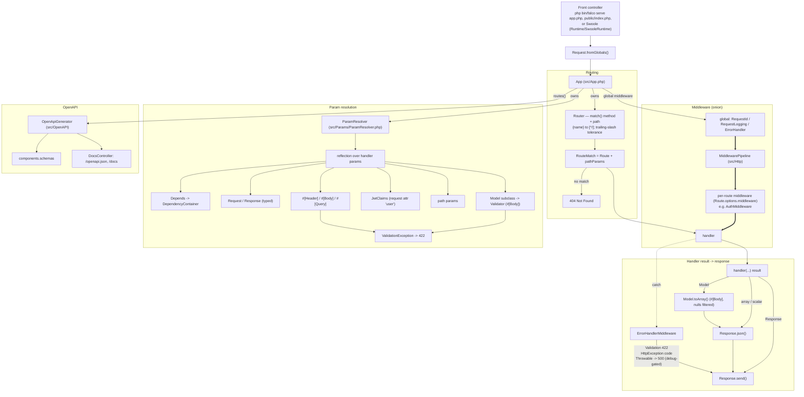

# Falco

A FastAPI-style web framework for PHP 8.1+. Declarative route handlers, type-based validation, automatic OpenAPI docs.

## Install

```bash
git clone <this-repo> && cd FastAPI-PHP
php composer.phar install
```

## Quick start

```php
<?php // app.php
require 'vendor/autoload.php';

use Falco\App;

$app = new App(title: 'Hello', version: '0.1.0');

$app->get('/', function (): array {
    return ['message' => 'Hello, World!'];
});

return $app;
```

## Run

```bash
php bin/falco serve examples/items/app.php
# → http://127.0.0.1:8000
```

For a full, production-ready example — JWT auth with refresh rotation, SQLite storage, `/health`, `/metrics`, CORS, rate limiting, structured logging — see `examples/items/app.php`. Its `conf.php` bootstraps environment (real env vars or `env.php` on shared hosts like Hostinger) and `public/` holds a shared-hosting front controller.

Note: `php bin/falco serve` uses PHP's single-threaded built-in server, so requests are handled sequentially. For concurrent traffic, run under nginx + php-fpm or Swoole (see `docs/PRODUCTION.md`).

## Features

- Type-hinted route handlers — query, path and body params resolved from plain PHP types
- `Model` classes with `fromArray` / `toArray` type coercion and validation
- `#[Depends]` dependency injection, `#[Query]`, `#[Header]`, `#[Body]` param attributes
- Path params resolved by name from the route template
- Automatic interactive API docs at `/docs` and OpenAPI schema at `/openapi.json`
- HTTP/1.1 built-in server (`php -S`) and an optional Swoole runtime (`--swoole`)
- Middleware pipeline with global and per-route middleware
- JWT authentication with refresh-token rotation
- Structured JSON logging
- Prometheus metrics (`/metrics`)
- Health checks (`/health/live`, `/health/ready`)
- CORS, security headers, and rate limiting
- Zero runtime dependencies — pure PHP 8.1+

## Production

For production-ready deployment, see `examples/items/` which includes:
- JWT auth with access + refresh token rotation
- `/health/live`, `/health/ready` endpoints
- `/metrics` for Prometheus scraping
- CORS, security headers, rate limiting, request ID, error handling
- Structured JSON request logging

See also `docs/PRODUCTION.md` for environment variables, deploy targets, and security notes.

## Architecture

Falco is a thin, layered framework. It is deliberately dependency-free at runtime (only stdlib + a single `vendor/autoload.php` bootstrap from Composer, which maps the PSR-4 `Falco\` namespace to `src/`). The entry point is an **app file** that returns a `Falco\App`; a small front controller dispatches each request through `Request::fromGlobals()` and calls `App::handle()`.



### Key components

- **Routing** (`Router`, `Route`, `RouteMatch`): O(n) linear scan; path templates use `{name}` captured as `[^/]` — no backtracking surprises, no regex injection. `matchTemplate()` builds a single anchored PCRE per route. Trailing slashes (other than the root) are trimmed before matching.
- **Param resolution** (`ParamResolver`): reflection-based argument resolver. Resolution order: `#[Depends]` → framework types (`Request`/`Response`) → `Model` subclass (`#[Body]`) → `JwtClaims` (reads `$request->attributes['user']`) → path param → `#[Header]` → `#[Body]` → `#[Query]`. Scalar/array params without attributes default to query resolution (matches FastAPI ergonomics).
- **Validation** (`Validation\Validator`, `Model`): reflection-driven `fromArray()` coercion with type coercion + `Field required` `ValidationException` (FastAPI-style `{"loc":[...],"msg":...,"type":"missing"}`). `SchemaBuilder` turns PHP types into OpenAPI schemas; `BackedEnum` becomes an `enum`, union types become `anyOf`.
- **Middleware** (`Http/MiddlewareInterface`, `MiddlewarePipeline`): standard `(Request, next): Response` onion; supports both class middleware (`MiddlewareInterface`) and plain closures as middleware. Global middleware (registered on `App`) wrap everything; per-route middleware (`options['middleware']`) wrap only the handler.
- **Auth** (`Security\JwtService`, `JwtClaims`, `JwtException`, `Middleware\AuthMiddleware`): HS256 JWT with `hash_equals` constant-time signature check, `exp` enforcement, b64url encoding. `AuthMiddleware` is opt-in per route; on success it attaches a `JwtClaims` to request attributes for the resolver. `RefreshTokenRepository` stores SHA-256 token hashes, enforces single-use (`consumed_at`), supports revocation.
- **Rate limiting** (`Middleware\RateLimitMiddleware` + `RateLimitStoreInterface`): default in-memory store; `SqliteRateLimitStore` persists windows across workers (swap in your own backend via the interface). CORS middleware emits `Vary: origin` and explicit allow-methods on preflight.
- **Data** (`Data\Connection`): thin PDO wrapper (`fromDsn`, `query`, `exec`) — swap SQLite for Postgres/MySQL by DSN, zero abstraction tax.
- **Observability** (`Logging`, `Metrics`, `Health`): `Logger` emits JSON lines with request ID correlation, safe-against `json_encode` failure (substitutes invalid UTF-8, re-descends `JsonSerializable`). `Metrics` (`Counter`/`Histogram`, `Registry`, `PrometheusTextFormatter`) is a simple in-memory registry; `MetricsMiddleware` records per-route metrics and exposes `/metrics` in Prometheus text format. `HealthController` registers `/health/live` (always 200) and `/health/ready` (custom check callbacks; 503 on failure).
- **Runtime**: `bin/falco serve` defaults to PHP's built-in `php -S` server (with `bin/server.php` as the router); `--swoole` uses `Runtime/SwooleRuntime` when `ext-swoole` is available. For shared hosting / Apache / nginx+php-fpm, drop `public/index.php` + `.htaccess` into your document root — it calls `App::handle(Request::fromGlobals())` exactly like `bin/server.php`.

### Request lifecycle

1. `Request::fromGlobals()` (or Swoole runtime equivalent) parses method, path, query, JSON body, headers.
2. `App::handle()` wraps `dispatch()` in the global middleware pipeline (e.g. `RequestId → RequestLogging → ErrorHandler`).
3. `Router::match()` returns a `RouteMatch` (or 404).
4. Per-route middleware pipeline runs (e.g. `AuthMiddleware`), then `invokeHandler()`.
5. `ParamResolver::resolve()` binds handler args from the request (types + attributes).
6. Handler returns a `Response`, a `Model` (serialized via `toArray()`), an array, or a scalar.
7. Exceptions are mapped: `ValidationException → 422`, `HttpException → its code`, any other `Throwable → 500` (debug-gated detail).
8. `Response::send()` writes headers + JSON body.

## Environment

Falco reads configuration from process environment variables (see `docs/PRODUCTION.md`):

| Variable | Required | Description |
|---|---|---|
| `FALCO_JWT_SECRET` | Yes | HMAC secret for JWT (≥32 chars) |
| `FALCO_SQLITE_PATH` | No | SQLite file path (default `data/app.sqlite`) |
| `FALCO_CORS_ORIGINS` | No | Comma-separated allowed origins |
| `FALCO_METRICS` | No | `1` enables `/metrics` |
| `FALCO_SEED_PASSWORD` | No | Seeds an `admin` user on startup |

Shared hosts (e.g. Hostinger Premium) usually can't set real environment variables, so the example app's `conf.php` bootstrap also reads from `env.php`/`env.example.php`. Set `FALCO_JWT_SECRET` there and keep the app file outside the document root.

## Swoole note

`php bin/falco serve app.php --swoole` serves via Swoole when the `ext-swoole` extension is installed. Without it, Falco falls back to PHP's built-in server.